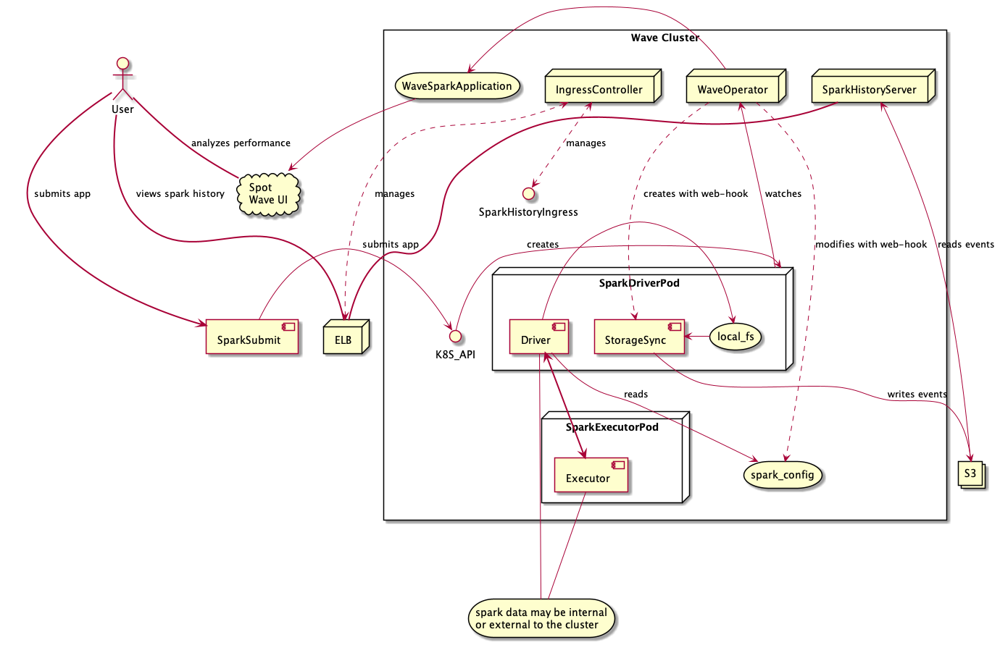
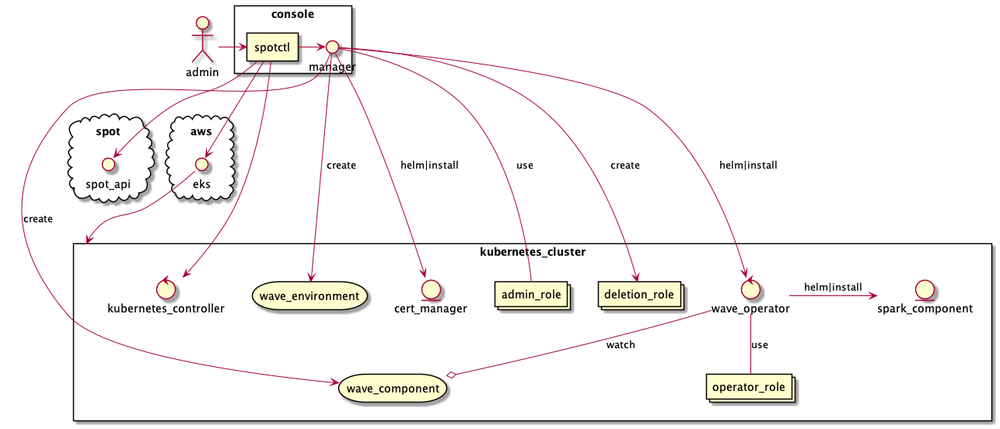
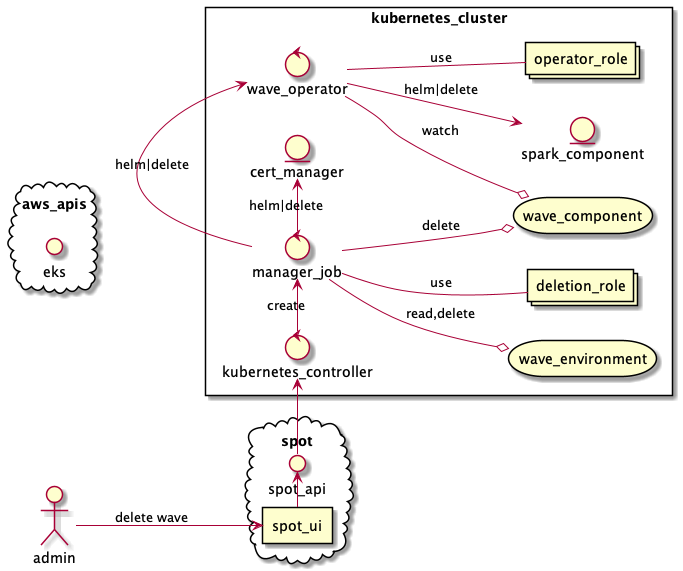

# Architecture

This document describes the architecture of the wave-operator, its 
major constituents and how they interact.

The wave operator includes two controllers based on the kubebuilder 
framework. One of these handles wave components as part of the lifecycle
of the wave operator itself. The other handles pods as part of the
spark application life-cycle

## WaveComponent management

### WaveComponents

### Helm and the install package

## SparkApplication management

### SparkPod Controller

### Mutating Web Hook

## Dependencies: Cert-Manager

Because the mutating web hook must use TLS, we must create a certificate
for it before the wave-operator itself can be installed. The certificate is
provided by [cert-manager](https://github.com/jetstack/cert-manager) 

## Installation

### tide and spotctl

## Cloud Providers

storage

## Spot and the Ocean Controller

no direct connection
